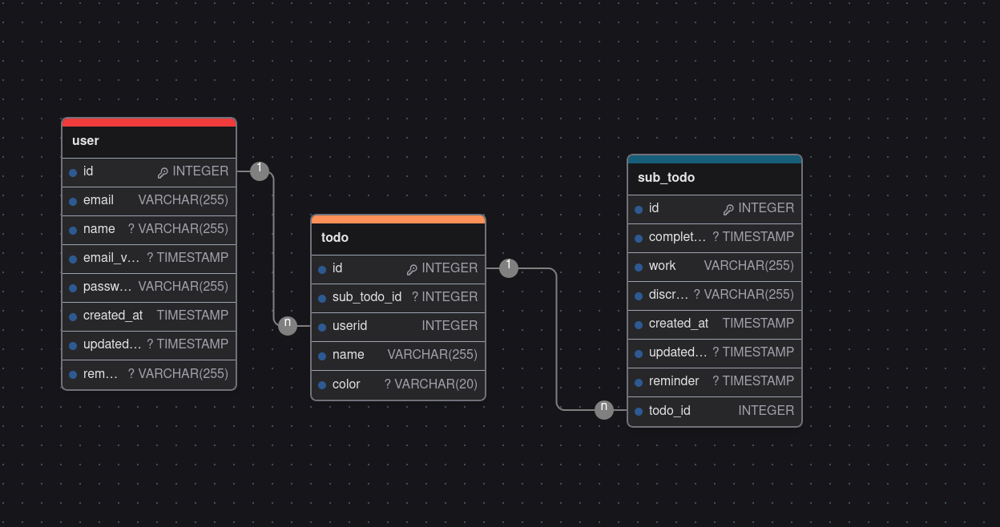

# Todo app
>the app is in production stage some features are partially implimented(it's broken )

I started it as a sunday project just for implimentation of my learning in 
- laravel
- livewire
- alpine 
- pwa and web notifications (yet to impliment)
- laravel queue and worker
- task scheduling with laravel

database architechture

#### why its here on github
I just uploaded it because I don't want to lose it like my other projects whome i got lost due to hardware faliure, and I know its incomplete project
but i think project are made for fun and learning. I made this because i want to impliment my knowledge of laravel and livewire

Thankyou for time